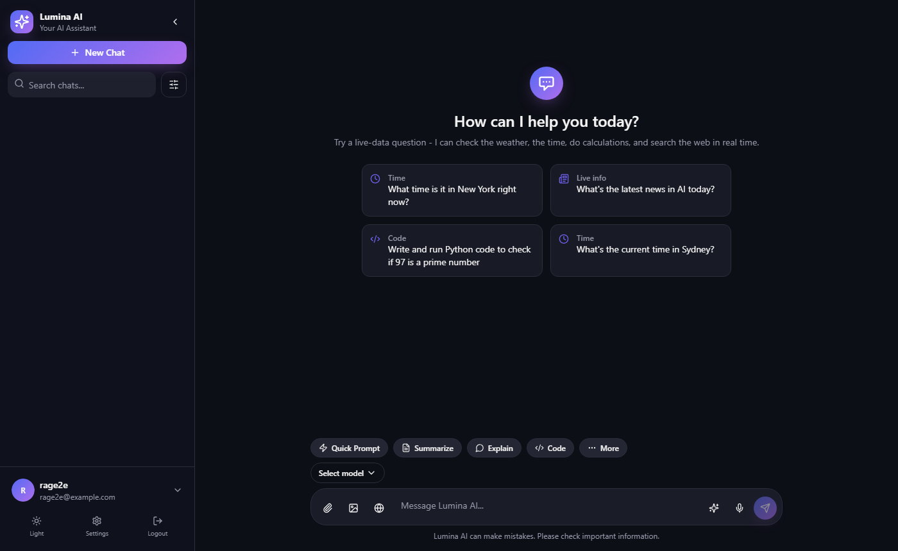
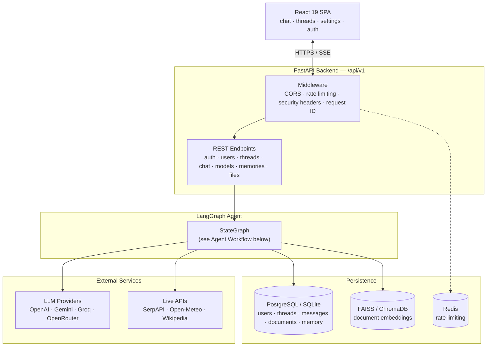
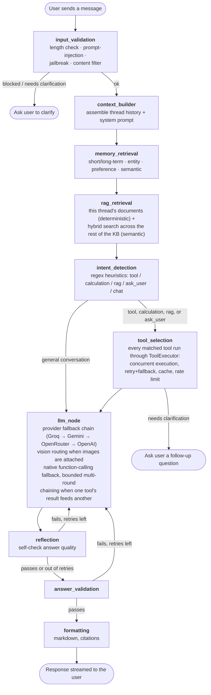
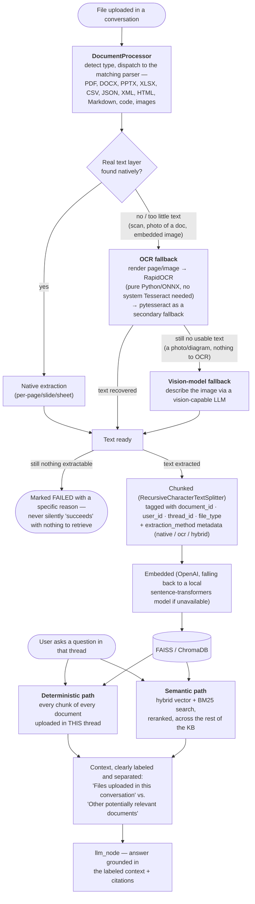
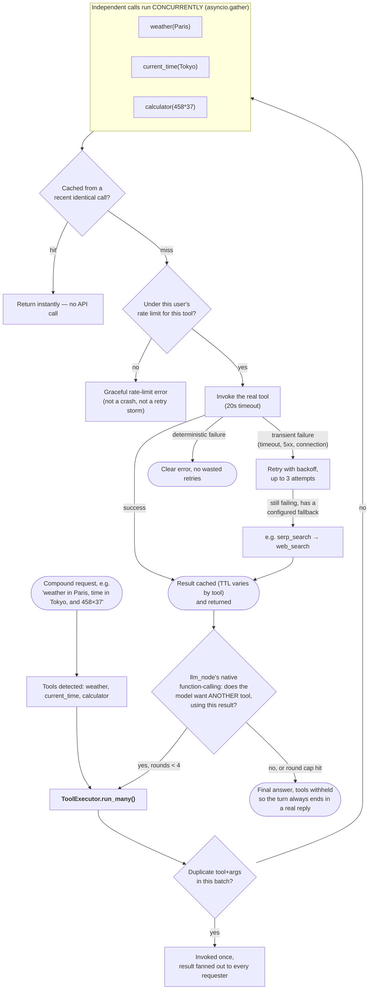

# Lumina AI

**An agentic AI chatbot with a real LangGraph state machine — live tool-calling (weather, time, calculator, web search), multimodal RAG over your documents and images, multi-provider LLM routing with automatic fallback, and durable, thread-scoped conversation memory.**

Built with FastAPI + LangGraph on the backend and React 19 + TypeScript on the frontend.

---

## Table of Contents

- [What this is](#what-this-is)
- [Features](#features)
- [Architecture](#architecture)
- [Agent Workflow](#agent-workflow)
- [Multimodal RAG Pipeline](#multimodal-rag-pipeline)
- [Conversations, Memory & Sessions](#conversations-memory--sessions)
- [Available Tools](#available-tools)
- [Tool Orchestration & Performance](#tool-orchestration--performance)
- [Chat Input Controls](#chat-input-controls)
- [Tech Stack](#tech-stack)
- [Project Structure](#project-structure)
- [Getting Started](#getting-started)
- [Configuration](#configuration)
- [API Overview](#api-overview)
- [Database Schema](#database-schema)
- [Security](#security)
- [Testing](#testing)
- [Documentation](#documentation)
- [License](#license)

---

## What this is

Most "AI chatbot" starter repos are a thin wrapper around one LLM API. This one runs every message through an actual **LangGraph state machine**: the agent validates input, retrieves memory and any relevant documents, classifies intent, decides whether it needs a live tool, calls that tool, generates a response with automatic provider fallback, reflects on its own answer, retries if the answer doesn't hold up, and formats the final output — all before it reaches the user.

Ask it "what's the weather in Tokyo right now" and it actually calls a weather API. Upload a spreadsheet and ask it to summarize the file, and it actually reads the file — deterministically, not by hoping a vector search happens to match a vague question. Attach a photo and ask what's in it, and a real vision model looks at it. That's the point of the project: a chatbot that can *do* things and *see* things, not just talk about them.



## Features

- **LangGraph agent** — a real `StateGraph` with conditional routing, retry loops, and self-reflection (see [Agent Workflow](#agent-workflow))
- **Live tool-calling with real orchestration** — current time (any timezone/city), weather, a calculator, web search (DuckDuckGo/SerpAPI), Wikipedia lookups, sandboxed Python execution, and knowledge-base search, selected automatically per message (regex fast-path + native LLM function-calling fallback). Independent tools in the same turn run **concurrently**, dependent tools **chain** across bounded rounds when one's output feeds another, results are **cached** and **deduplicated** so the same call is never paid for twice, and everything is **rate-limited per user** (see [Tool Orchestration & Performance](#tool-orchestration--performance))
- **Location-aware, self-correcting geocoding** — misspellings ("banglore"), historical/colonial names that resolve to the wrong place entirely ("Calcutta" → South Africa, "Saigon" → Chad on the raw API), and compound multi-city questions ("weather in Paris, what time is it in Tokyo") are all corrected and scoped per-tool before hitting a live weather/time lookup, with retries and population-aware disambiguation between same-named places
- **Multimodal RAG** — upload PDF, DOCX, PPTX, TXT, Markdown, CSV, XLSX, JSON, XML, HTML, source code, or images; each is parsed, chunked, embedded, and indexed automatically, and is available for question-answering in that conversation immediately, with no need to re-reference it by name (see [Multimodal RAG Pipeline](#multimodal-rag-pipeline))
- **OCR + vision fallback for scanned/image-based documents** — a PDF page, DOCX, or PPTX with no real text layer (a scan, a photo of a document, an embedded picture) is rendered and run through OCR (RapidOCR, pure Python/ONNX — no system Tesseract binary required) automatically; a standalone photo with no extractable text falls further back to a real vision-model description, so "image with no text" still indexes something meaningful
- **Vision** — attach an image in chat and ask questions, request a description, extract text, or reason about the scene, via a real vision-capable model (GPT-4o / Gemini / OpenRouter), with a local-OCR-plus-text fallback if no vision provider is reachable. Click any thumbnail for a full lightbox with zoom, pan, and download
- **Durable, thread-scoped memory** — conversation history is rebuilt from the database on every turn, not trusted to an in-process cache, so it survives a server restart and is consistent across devices; long-term facts (name, preferences, entities) are remembered globally across every conversation, while each thread's own uploaded files and message history stay scoped to that thread (see [Conversations, Memory & Sessions](#conversations-memory--sessions))
- **Multi-provider LLM routing** — OpenAI, Gemini, Groq, and OpenRouter behind one interface, with an automatic fallback chain, per-provider cooldown on failure, and vision-aware routing that skips providers whose model can't accept images
- **ChatGPT-style sessions** — persistent login with a shared auth context (not per-component state), remember-me, automatic session restoration, silent token refresh, and clean logout that revokes only the current session without touching any chats or memories
- **Streaming responses** — token-by-token SSE streaming, with mid-generation tool-activity status ("Checking the weather…")
- **Full message actions** — edit a past message in place (truncates and regenerates everything after it), regenerate any assistant reply, and copy any message's content
- **Chat input controls** — a web-search toggle, an AI-tools picker fetched live from the backend's own tool registry, and real browser voice input (Web Speech API, with permission/error handling and a live "Listening…" indicator) — see [Chat Input Controls](#chat-input-controls)
- **Auth & security** — JWT access/refresh tokens, server-side refresh-token revocation, account lockout, bcrypt password hashing, rate limiting (Redis-backed with in-memory fallback), CORS, security headers, and regex-based prompt-injection / jailbreak / content-filtering guardrails on every message
- **Startup dependency validation** — every RAG parsing/OCR dependency (pypdf, python-docx, python-pptx, openpyxl, RapidOCR, PyMuPDF, ...) is import-checked at boot, logged loudly if anything's missing, and surfaced on `GET /health` — a broken interpreter is visible immediately instead of only failing on someone's first upload
- **Observability** — structured JSON logging at every RAG/agent stage, OpenTelemetry tracing, and optional LangSmith tracing for the agent graph
- **MCP integration** — the tool registry doubles as a FastMCP server, so the same tools are usable by any MCP-compatible client
- **Docker-ready** — `docker-compose up --build` runs the full stack; SQLite by default for zero-config local dev, PostgreSQL for production

## Architecture



## Agent Workflow

This is the actual `StateGraph` assembled in [`backend/app/agents/graph.py`](backend/app/agents/graph.py) — every chat message flows through this pipeline.



**Why this matters in practice:** intent detection is a fast regex pre-filter, not the only path to a tool call — if it misses a live-data question, `llm_node` still offers the LLM native function-calling as a fallback. Every LLM call goes through the provider fallback chain, so a single provider outage degrades gracefully to the next one instead of failing the turn. `tool_selection` and `llm_node`'s native function-calling both execute through the exact same `ToolExecutor` (see [Tool Orchestration & Performance](#tool-orchestration--performance)), so a tool behaves identically — same timeout, retry, fallback, caching, rate-limiting — no matter which path triggered it. And `rag_retrieval` doesn't rely on semantic similarity alone: a vague question like *"describe this file"* has almost no vector similarity to the file's actual content, so the documents uploaded in the current thread are always included, deterministically — see the next section.

## Multimodal RAG Pipeline

Upload a file mid-conversation and it's parsed, chunked, embedded, and indexed synchronously — by the time the upload request returns, it's queryable. The interesting part is *retrieval*, not just indexing: a generic RAG pipeline that only does similarity search reliably fails on exactly the kind of question people actually ask right after uploading something ("describe this file", "summarize this") — a vague meta-question has no real semantic resemblance to the file's own content, so it can rank behind (or lose to) unrelated documents from other conversations entirely.



- **Never rejects a supported file for being "just" an image or a scan**: a PDF is checked page-by-page — a hybrid document (some real pages, some scanned) gets `extraction_method: hybrid`, not an all-or-nothing failure. Every image (standalone or embedded in a DOCX/PPTX) is OCR'd, and a genuinely text-free photo still gets indexed via a vision-model description rather than being skipped.
- **Deterministic thread-scoping**: `Document.thread_id` ties an upload to the conversation it happened in. `RAGRetrievalNode` fetches every chunk of every document in the current thread directly by id — no similarity threshold to clear, no ranking to lose. This is what makes "describe this file" work regardless of phrasing.
- **Clearly labeled context**: thread documents and semantic-search results are never silently merged into one undifferentiated block — they're presented to the model as two distinct, labeled sections, so a broadly-relevant older document from a different conversation can't get confused for "the file" the user is currently asking about.
- **Fails loud, not silent**: a corrupted file or an image with nothing OCR-able is marked `FAILED` with a specific, user-visible reason, instead of reporting success with zero indexed content (which is what used to produce "no file was provided"-style answers).
- **Metadata filtering**: every chunk carries `file_type`, so retrieval (and the `knowledge_base_search` tool) can be scoped to just PDFs, just spreadsheets, etc.

## Conversations, Memory & Sessions

Three different persistence guarantees, each scoped correctly on purpose:

| Scope | What it covers | Behavior |
|---|---|---|
| **Per-thread, durable** | Message history, uploaded documents | Rebuilt from the database every turn (not an in-process cache) — survives a restart, consistent across devices and multiple backend workers. A brand-new thread starts with zero history. |
| **Global, per-user** | Entities, preferences, long-term facts | Retrieved by `user_id` regardless of thread — a fact learned in one conversation ("my name is...") is available in every other conversation immediately, without re-stating it. |
| **Per-session, client-side** | Login state | JWT access + refresh tokens, remember-me controlled (persistent `localStorage` vs. tab-only `sessionStorage`), restored automatically on load, refreshed silently on expiry, revoked server-side (only the current session) on logout — chats and memories are untouched by logout. |

Auth state lives in a single shared React context (`AuthProvider`), not duplicated per-component — so logging out in the sidebar is reflected immediately everywhere else in the app, not just wherever the click happened.

## Available Tools

| Tool | What it does | Example prompt |
|---|---|---|
| `current_time` | Current date/time in any city or IANA timezone | *"What time is it in Tokyo right now?"* |
| `weather` | Live weather + forecast via Open-Meteo (no key required) | *"Is it raining in London today?"* |
| `calculator` | Evaluates arithmetic expressions | *"What is 4572 divided by 37?"* |
| `web_search` | DuckDuckGo web search | *"What's the latest news in AI today?"* |
| `serp_search` | Live Google results via SerpAPI (falls back to `web_search` if unavailable) | *"What's today's gold price in Hyderabad?"* |
| `wikipedia` | Encyclopedic lookups | *"Who is Ada Lovelace?"* |
| `python_executor` | Sandboxed Python execution (no `os`/`subprocess`/`socket`, 10s timeout) | *"Write and run Python to check if 97 is prime"* |
| `knowledge_base_search` | Hybrid search over your uploaded documents, optionally filtered by file type | *"What does my uploaded contract say about termination?"* |
| `ask_user` | Asks a clarifying follow-up instead of guessing | *"Which one should I pick?"* |

A single message can trigger several tools at once (e.g. *"what's the time and weather in Paris"* runs both concurrently) — see below for exactly how.

## Tool Orchestration & Performance

Every tool call — whether it came from the fast regex path (`tool_selection`) or the LLM's own native function-calling (`llm_node`) — runs through one shared engine: [`ToolExecutor`](backend/app/tools/executor.py). Before this existed, the two paths had genuinely different reliability: the regex path retried and timed out properly, native function-calling ran tools in a bare sequential loop with none of that. Now both get identical guarantees.



- **Parallel, not sequential** — independent tools in one request (or one native-function-calling round) run concurrently via `asyncio.gather`, not one after another. A 3-tool compound query takes as long as its *slowest* tool, not the sum of all three.
- **Duplicate-call suppression** — the same tool+args requested twice in one batch (a known LLM quirk) is invoked once; every requester gets the same result.
- **Caching, tuned per tool** — calculator/Wikipedia results cache for 5 minutes, weather for 90 seconds, web search for 30 seconds. `current_time` is **never** cached (would silently serve stale wall-clock time) and `knowledge_base_search` is **never** cached (results are user/thread-scoped, not safe to share process-wide).
- **Per-user, per-tool rate limiting** — a sliding window (20 calls/60s by default) protects both upstream API quotas (SerpAPI, Open-Meteo) and against a runaway caller, with a clear rejection result instead of a crash or a silent hang.
- **Retry + fallback** — transient failures (timeouts, 5xx, connection resets) get up to 3 attempts with backoff; deterministic failures (bad input) fail once, fast. `serp_search` transparently falls back to the free `web_search` tool on outage or quota exhaustion.
- **Bounded multi-round chaining** — when a tool's result is genuinely needed by a *second* tool call (native function-calling only), the model is re-offered tools for up to 4 rounds so a dependent chain can complete, capped so a model that won't stop asking for tools can't loop indefinitely — the final round always withholds tools and forces a real answer.

## Chat Input Controls

Three controls sit in the message composer, each backed by real functionality rather than being cosmetic:

| Control | Behavior |
|---|---|
| **Globe (web search)** | Toggles a one-shot "search the web for this" mode for the next message — phrased to land on the same deterministic intent-detection pattern a user typing it naturally would, so it's provably the same code path, not a separate hidden channel. |
| **Sparkles (AI tools)** | Opens a popover that fetches the assistant's actual capabilities live from `GET /api/v1/tools` (backed by the same tool registry the agent uses) — a loading state while fetching, and clicking a tool inserts a working example prompt. Also houses the "detailed answer" one-shot mode. |
| **Microphone (voice input)** | Real browser speech-to-text via the Web Speech API — live interim transcript streamed into the composer, a pulsing "Listening…" indicator, and specific error toasts for permission-denied / no-speech / no-microphone / unsupported-browser, not a silent no-op. |

## Tech Stack

| Layer | Technology |
|---|---|
| Frontend | React 19, TypeScript, Vite, TailwindCSS, Radix UI, React Query, React Router |
| Backend | Python, FastAPI, Uvicorn, Pydantic v2 |
| Agent framework | LangGraph, LangChain |
| LLM providers | OpenAI, Google Gemini, Groq, OpenRouter |
| Database | SQLAlchemy (async) — SQLite (dev) / PostgreSQL (prod) |
| Vector store | FAISS / ChromaDB, `sentence-transformers` embeddings, BM25 hybrid search |
| Document parsing | pypdf, python-docx, python-pptx, openpyxl, pandas, BeautifulSoup |
| OCR / scanned documents | RapidOCR (`rapidocr-onnxruntime`, pure Python/ONNX — no system Tesseract binary needed), PyMuPDF for page rendering, pytesseract as a secondary fallback |
| Voice input | Web Speech API (`SpeechRecognition`), native to the browser — no third-party speech service |
| Auth | JWT (access + refresh), bcrypt, server-side token revocation |
| Cache / rate limiting | Redis (with in-memory fallback) |
| Observability | OpenTelemetry, LangSmith |
| Tool protocol | FastMCP (Model Context Protocol) |
| Testing | pytest + pytest-asyncio (backend), Vitest + Playwright (frontend) |
| Deployment | Docker, Docker Compose, NGINX |

## Project Structure

```
ai-chatbot/
├── frontend/               React 19 + TypeScript + Vite SPA
│   └── src/
│       ├── pages/          chat, login, register, settings, profile
│       ├── components/     chat UI, sidebar, shared components
│       └── hooks/, lib/    React Query hooks, API client, shared AuthProvider
├── backend/
│   ├── app/
│   │   ├── agents/         LangGraph StateGraph, nodes (incl. tool_selection, llm_node), prompts
│   │   ├── tools/          tool registry, ToolExecutor (parallel/cache/retry/rate-limit),
│   │   │                   geocoding (alias + fuzzy correction), built-in tools
│   │   ├── llm/             provider abstraction, vision helpers, router with fallback
│   │   ├── memory/         memory manager (short/long-term, entity, semantic)
│   │   ├── rag/             document processing (native + OCR + vision fallback), embeddings,
│   │   │                   hybrid search, reranking
│   │   ├── mcp/             FastMCP client & server
│   │   ├── security/       guardrails (prompt injection, jailbreak, content filter)
│   │   ├── api/v1/         REST endpoints (auth, users, threads, chat, models, memories, files, tools)
│   │   ├── db/              SQLAlchemy models, session, lightweight migrations
│   │   ├── services/       business logic (auth, chat, user, thread)
│   │   ├── repositories/   data access layer
│   │   └── core/           config, DI container, middleware, logging, startup dependency validation
│   └── tests/               pytest suite — auth, config, security, tools, tool orchestration/chaining,
│                             geocoding, weather/time, document processing, RAG pipeline
├── docs/                   architecture, API reference, DB schema, deployment guides
├── docker/                 Dockerfiles, docker-compose
├── deployment/             Kubernetes / CI-CD configs
└── scripts/                dev launcher scripts
```

## Getting Started

### Prerequisites

- Python 3.11+ (developed/tested on 3.12)
- Node.js 18+
- At least one LLM provider API key (OpenAI, Gemini, Groq, or OpenRouter)

### 1. Configure environment

```bash
cp .env.example .env
# Fill in at least one LLM provider key (OPENAI_API_KEY / GEMINI_API_KEY / GROQ_API_KEY / OPENROUTER_API_KEY)
# SERPAPI_API_KEY is optional — live search falls back to a free DuckDuckGo scraper without it
```

No database setup is required for local dev — it defaults to SQLite, and schema changes apply automatically via a lightweight migration step on startup (see `backend/app/db/session.py`). Set `DATABASE_URL` to a `postgresql://` URL for production.

### 2. Run it

**Docker (full stack):**
```bash
docker-compose up --build
```

**Locally, via Make (macOS/Linux):**
```bash
make setup   # pip install backend deps + npm install frontend deps
make backend   # terminal 1 → http://localhost:8000
make frontend  # terminal 2 → http://localhost:5173
```

**Locally, on Windows:**
```powershell
# Installs are one-time:
pip install -r backend/requirements.txt
cd frontend && npm install

# Then just double-click run-dev.cmd, or:
./scripts/run-dev.ps1
```
This starts both servers, health-checks them, and opens the frontend in your browser — backend at `http://127.0.0.1:8001`, frontend at `http://127.0.0.1:5173`.

Interactive API docs are available at `/docs` on whichever port the backend is running on (FastAPI's built-in Swagger UI).

## Configuration

All configuration lives in `.env` (see [`.env.example`](.env.example) for the full annotated template):

| Section | What it controls |
|---|---|
| Application / Server | app name, host, port, debug mode |
| Database | `DATABASE_URL` — SQLite by default, PostgreSQL for production |
| Redis | cache + rate-limiting backend (optional; falls back to in-memory) |
| Vector Database | FAISS/ChromaDB path and settings |
| LLM Providers | API keys for OpenAI, Gemini, Groq, OpenRouter, and default models per provider |
| Embeddings | embedding model for RAG |
| Live search | `SERPAPI_API_KEY` for live Google results (optional) |
| Authentication | JWT secret/algorithm, token lifetimes |
| Rate Limiting | requests-per-minute thresholds (standard vs. streaming) |
| Observability | OpenTelemetry exporter endpoint, LangSmith key/project |
| Uploads | max file size, allowed types |

## API Overview

Base URL: `/api/v1`. Every endpoint except `/auth/*` requires a `Bearer` access token.

| Resource | Endpoints |
|---|---|
| **Auth** | `POST /auth/register`, `/login`, `/refresh`, `/logout`, `/change-password`, `/forgot-password`, `/reset-password` · `GET /auth/me` |
| **Users** | `GET/PATCH /users/me`, `GET/PATCH /users/me/settings` |
| **Threads** | `POST/GET /threads`, `GET/PATCH/DELETE /threads/{id}`, `POST /threads/{id}/archive`, `/pin`, `/unpin`, `GET /threads/{id}/messages` |
| **Chat** | `POST /chat/messages` (non-streaming, supports `images[]`), `POST /chat/stream` (SSE), `POST /chat/regenerate/stream`, `POST /chat/messages/{id}/feedback` |
| **Models** | `GET /models`, `GET /models/providers` |
| **Memory** | `GET/POST /memories`, `PATCH/DELETE /memories/{id}`, `DELETE /memories` (clear all), `GET /memories/context` |
| **Files** | `POST /files/upload`, `POST /files/documents` (upload + index for RAG, optional `thread_id` to scope it to a conversation), `GET /files/documents`, `DELETE /files/documents/{id}` |
| **Tools** | `GET /tools` — the assistant's live capability list (name, description, example prompt), used by the frontend's AI-tools picker |

`GET /health` (outside `/api/v1`, no auth required) reports overall status plus a `rag_dependencies` map of every parsing/OCR package and whether it actually imported in the running process — check this first if uploads start failing with a missing-module error.

Full reference: [`docs/api.md`](docs/api.md).

## Database Schema

| Table | Purpose |
|---|---|
| `users` | accounts, credentials, role, provider |
| `threads` | conversations |
| `messages` | chat turns (user/assistant/system), including image attachments |
| `memory` | short/long-term, entity, preference, semantic, summary records |
| `documents` | uploaded files indexed for RAG — `thread_id` (nullable) scopes a document to the conversation it was uploaded in |
| `embeddings` | vector chunks for retrieval |
| `feedback` | per-message thumbs up/down |
| `user_settings` | per-user preferences |
| `logs` | structured application logs |
| `files` | uploaded file metadata |
| `revoked_tokens` | refresh-token deny-list (logout / rotation) |
| `account_lockouts` | failed-login tracking for brute-force protection |

Full reference: [`docs/database.md`](docs/database.md).

## Security

- **Authentication**: JWT access (short-lived) + refresh (long-lived) tokens, bcrypt password hashing
- **Token revocation**: refresh tokens are revoked server-side on logout via a `revoked_tokens` deny-list — logging out on one device doesn't touch sessions on any other device, matching how a real "log out" (as opposed to "log out everywhere") should behave
- **Guardrails**: every message passes through regex-based prompt-injection, jailbreak, and content-filter detection before it reaches the LLM
- **Rate limiting**: Redis-backed sliding window, per-user or per-IP, with separate (lower) limits for streaming endpoints
- **Transport**: CORS allow-list, security headers (CSP, X-Frame-Options, X-Content-Type-Options, etc.) on every response
- **Document isolation**: every retrieval is scoped by `user_id` (and, within a conversation, `thread_id`) — vector search has no inherent per-user boundary, so this is enforced explicitly at the retriever level, not assumed

## Testing

```bash
# Backend
cd backend
pytest tests/ -v
# Covers: auth, config, security, tools, tool-executor concurrency/caching/
# rate-limiting/retry-fallback, multi-round tool chaining, geocoding
# (alias/misspelling correction, disambiguation, retries), weather/time,
# document extraction for every supported file type (incl. OCR fallback for
# scanned PDFs and image-only documents), and the full RAG pipeline (upload
# → thread-scoped retrieval → context injection) — using an isolated
# in-memory DB and an offline fake embedder where applicable, no network
# calls, no shared state with your dev data.

# Frontend
cd frontend
npm run lint
npm run test        # unit tests (Vitest)
npm run test:e2e     # Playwright end-to-end tests
```

## Documentation

- [Installation Guide](docs/installation.md)
- [Deployment Guide](docs/deployment.md)
- [Developer Guide](docs/developer.md)
- [Architecture](docs/architecture.md)
- [Agent Graph Reference](docs/graph.md)
- [API Reference](docs/api.md)
- [Database Schema](docs/database.md)

## License

MIT
